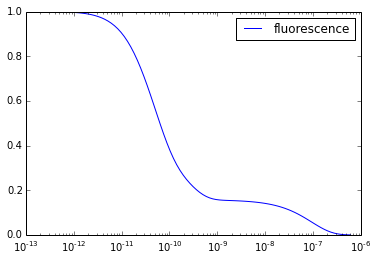

.. code:: python

    from models.holzwarth.naive import model as m1
    from models.holzwarth.final import model as m2
    from pysb.integrate import odesolve
    from pysb import bng
    import numpy as np
    import matplotlib.pyplot as plt
    %matplotlib inline
.. code:: python

    t = np.logspace(np.log10(0.0000000000001), np.log(0.002), 100);
.. code:: python

    y = odesolve(m1, t)
.. code:: python

    y.dtype

.. parsed-literal::

    dtype([('__s0', '<f8'), ('__s1', '<f8'), ('__s2', '<f8'), ('__s3', '<f8'), ('__s4', '<f8'), ('__s5', '<f8'), ('Ant_exc', '<f8'), ('ChlD1_exc', '<f8')])

.. code:: python

    for n in range(6):
        plt.plot(t, y['__s%s' % n], label='s%s' % n)
    plt.xscale('log')
    plt.legend()

.. parsed-literal::

    <matplotlib.legend.Legend at 0x4d24990>

.. image:: experiments_files/experiments_4_1.png

.. code:: python

    plt.plot(t, y['Ant_exc'] + y['ChlD1_exc'], label='fluorescence')
    plt.xscale('log')
    plt.legend()

.. parsed-literal::

    <matplotlib.legend.Legend at 0x2975450>

.. code:: python

    bng.generate_network(m1) == bng.generate_network(m2)

.. parsed-literal::

    True

.. code:: python

    gen = bng.BngGenerator(m1)
.. code:: python

    print gen.get_content()

.. parsed-literal::

    begin parameters
      deex_heat    2.000000e+05
      qa_oxi       2.400000e+09
      ch_se        5.000000e+11
      stab_gen     2.500000e+11
      qa_red       4.800000e+09
      extrans      1.920000e+10
      extrans_re   2.500000e+10
      deex_flu     6.700000e+07
      ch_re        5.000000e+11
      stab_deg     6.700000e+10
      init         1.000000e+00
    end parameters
    
    begin molecule types
      PSII(P680~n~p,Qa~n~m,PhD1~n~m,ac~n~exc,ChlD1~n~p~exc)
    end molecule types
    
    begin observables
      Molecules Ant_exc     PSII(P680~n,Qa~n,PhD1~n,ac~exc,ChlD1~n)
      Molecules ChlD1_exc   PSII(P680~n,Qa~n,PhD1~n,ac~n,ChlD1~exc)
    end observables
    
    begin species
      PSII(P680~n,Qa~n,PhD1~n,ac~exc,ChlD1~n)   init
    end species
    begin reaction rules
      deexcitation_antenna_fluorescence:        PSII(P680~n,Qa~n,PhD1~n,ac~exc,ChlD1~n) -> PSII(P680~n,Qa~n,PhD1~n,ac~n,ChlD1~n)    deex_flu
      deexcitation_antenna_heat:                PSII(P680~n,Qa~n,PhD1~n,ac~exc,ChlD1~n) -> PSII(P680~n,Qa~n,PhD1~n,ac~n,ChlD1~n)    deex_heat
      deexcitation_ChlD1_fluorescence:          PSII(P680~n,Qa~n,PhD1~n,ac~n,ChlD1~exc) -> PSII(P680~n,Qa~n,PhD1~n,ac~n,ChlD1~n)    deex_flu
      deexcitation_ChlD1_heat:                  PSII(P680~n,Qa~n,PhD1~n,ac~n,ChlD1~exc) -> PSII(P680~n,Qa~n,PhD1~n,ac~n,ChlD1~n)    deex_heat
      excitation_transfer:                      PSII(P680~n,Qa~n,PhD1~n,ac~exc,ChlD1~n) <-> PSII(P680~n,Qa~n,PhD1~n,ac~n,ChlD1~exc)    extrans, extrans_re
      primary_charge_separation_recombination:  PSII(P680~n,Qa~n,PhD1~n,ac~n,ChlD1~exc) <-> PSII(P680~n,Qa~n,PhD1~m,ac~n,ChlD1~p)    ch_se, ch_re
      stable_pair_generation_degeneration:      PSII(P680~n,Qa~n,PhD1~m,ac~n,ChlD1~p) <-> PSII(P680~p,Qa~n,PhD1~m,ac~n,ChlD1~n)    stab_gen, stab_deg
      quinone_qa_reduction_oxidation:           PSII(P680~p,Qa~n,PhD1~m,ac~n,ChlD1~n) <-> PSII(P680~p,Qa~m,PhD1~n,ac~n,ChlD1~n)    qa_red, qa_oxi
    end reaction rules
    
    

